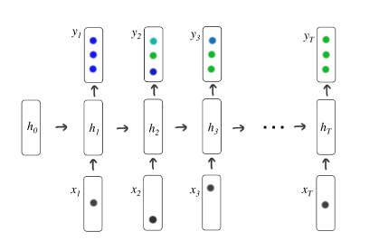

This post will illustrate the implementation of deep knowledge tracing. More details of the deep knowledge tracing, such as its limitations and corresponding potential solutions, are described in my note here: [Note on Deep Knowledge Tracing](). 

* TOC
{: toc}
## Deep Knowledge Tracing

Deep knowledge tracing (DKT) leverages the recurrent neural networks to capture the latent representation of student knowledge along with its temporal dynamics via encoding the student interactions. The knowledge tracing is to monitor a student's knowledge state given a sequence of past interactions or historical records, and predict if the one could answer next question correctly or not. In addition, the model output is a probability vector with size $Q$ where $i^{th}$ entry represents the probability that student could answer question  $i$ correctly. Intuitively, we could view the output at different time stamp as one student's knowledge state. 

The model could be visualized as below:

where

- Input: is a sequence of vectors $\mathbf{x}_1, \cdots, \mathbf{x}_T$, where $\mathbf{x}_t$ is the one-hot encoding of one student's historical interaction tuple $\{q_t, a_t\}$ ,  where $q_t$ is the question that student answered at time $t$, and $a_t$ is the binary value to indicate the correctness of student's answer. Since we need to encode both $q_t$ and $a_t$, we have $\mathbf{x}_t \in \{0, 1\}^{2Q}$ , where $Q$ is the size of question pool. If we use $\delta$ to denote the one-hot encoding function, then $\mathbf{x}_t = [ \delta(q_t), \delta(a_t)]$.  

  For example, there are total $5$ questions, and at time $t$ the question $1$ (with starting question index as 0) is answered correctly, then we have $\mathbf{x}_t$ as 

  

  
  $$
  \mathbf{x}_t = [0, 1, 0, 0, 0, 0, 1, 0, 0, 0]
  $$
  

  
- Output: is a sequence of vectors $\mathbf{y}_1, \cdots, \mathbf{y}_T$ , where $\mathbf{y}_t$ is a vector of length equal to the number of problems, where each entry represents the predicted probability that the student would answer that particular problem correctly. At time $t$, if question $i$ is answered by student, we would like to compare the $i^{th}$ entry of output $\mathbf{y}_t$ with the student's response $a_t$. 

- Loss: the training objective is to minimize the difference between the predicted student's correctness of response and the true correctness of response. The loss for a single student is 
  $$
  L = \sum_{t} \ell(\mathbf{y}_t^\top \delta(q_t), a_t)
  $$
  

The corresponding equations for DKT model are: 
$$
\begin{aligned}
&\mathbf{h}_{t}=\tanh \left(\mathbf{W}_{h x} \mathbf{x}_{t}+\mathbf{W}_{h h} \mathbf{h}_{t-1}+\mathbf{b}_{h}\right)\\
&\mathbf{y}_{t}=\sigma\left(\mathbf{W}_{y h} \mathbf{h}_{t}+\mathbf{b}_{y}\right)
\end{aligned}
$$
where $\mathbf{h}_t$ is a hidden state which could be viewed as encoding of relevant information from past observations. We will learn the parameters $\mathbf{W}_{hx}, \mathbf{W}_{hh}, \mathbf{W}_{yh}, \mathbf{b}_h, \mathbf{b}_y$ through training. 

## Implementation with Tensorflow 2.0

Here we use the ASSISTments 'skill-builder' dataset for illustration. The data with csv format looks like as below. 

