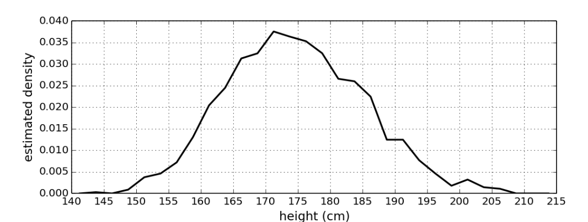

* TOC
{: toc}

## Data Augmentation for Auxiliary Variables

The idea of data augmentation is to introduce variable $Z$ that depends on the distribution of the existing variables in such as way that the resulting conditional distributions, with $Z$ included, are easier to sample from. 

Variable $Z$ could be viewed as latent or hidden variables, which are introduced for the purpose of simplifying or improving the sampler. Suppose we want to sample from $p(x, y)$ with Gibbs sampling, then we need to iteratively sample from $p(x \mid y)$ and $p(y\mid x)$ , which could be very complicated. Therefore, we could choose introduce the hidden variable $Z$ and $p(z\mid x, y)$ such that $p(x\mid y, z)$ , $p(y\mid x, z)$ and $p(z\mid x, y)$ are easy to sample from. In the next step, we could sample all three variables with Gibbs sampling, and throw aways all samples of $Z$ and keep samples (X, Y) from $p(x, y)$. 

## Example of 2-Component Gaussian Mixture

Given a dataset on heights of U.S. 300 women and 400 U.S. men, but we don't know which data points are from women and which are from men. However, we could have the combined distribution looks like below:

|  |
| :----------------------------------------: |
|    Heights of women and men, combined.     |

This is a two-component mixture of Gaussian, and there should have a unique set of mixture parameters corresponding to any such distribution. Let's assume that both mixture components have the same fixed and known  precision, say $\lambda$. Then, we could formulate the two-component Gaussian mixture model as:

$$
\begin{equation}
X_1, \cdots, X_n \mid \mu, \pi \sim F(\mu, \pi) \\
\end{equation}
$$

where $\mu$ denotes the mean of two components, which has a normal distributed prior:

$$
\mu := (\mu_0, \mu_1) \sim \mathcal{N}(\nu, \rho^{-1})
$$

and $\pi$ is the probability for being in the first component and has beta prior:

$$
\pi \sim Beta(\alpha, \beta)
$$

and $F(\mu, \pi)$ is the distribution with p.d.f:

$$
f(x \mid \mu, \pi) = (1-\pi) \mathcal{N}(x \mid \mu_0, \lambda^{-1}) + \pi \mathcal{N}(x \mid \mu_1, \lambda^{-1})
$$

Hence, we have the likelihood 

$$
\begin{align}
p(x_1, \cdots, x_n \mid \mu, \pi) &= \prod_{i=1}^{n} f(x_i \mid \mu, \pi) \\
&= \prod_{i=1}^{n} \left[ (1-\pi) \mathcal{N}(x_i \mid \mu_0, \lambda^{-1}) + \pi \mathcal{N}(x_i \mid \mu_1, \lambda^{-1}) \right]
\end{align}
$$

which is not conjugate with either prior of $\mu$ and prior of $\pi$. Therefore, the posterior distribution cannot be sampled directly. 

### Solution: Latent Allocation Variables

We could define an **equivalent** model that includes latent "allocation" variables $Z_1, \cdots, Z_n$ , each of which indicates whether subject $i$ is from female or male. 

$$
\begin{align}
X_i &\sim \mathcal{N}(\mu_{Z_i}, \lambda^{-1}) \ \ \forall i = 1, \cdots, n \\
Z_1, \cdots, Z_n &\sim Bernoulli(\pi) \\
\mu = (\mu_{0}, \mu_{1}) &\sim \mathcal{N}(\nu, \rho^{-1}) \\
\pi &\sim Beta(\alpha, \beta)
\end{align}
$$

and the p.d.f is same as before

$$
\begin{align}
p(x_i \mid \mu, \pi) &= p(x\mid Z_i=0, \mu, \pi) p(Z_i=0 \mid \mu, \pi) + p(x \mid Z_i=1, \mu, \pi)p(Z_i=1\mid \mu, \pi ) \\
&= \mathcal{N}(x_i \mid \mu_0, \lambda^{-1})(1-\pi) + \mathcal{N}(x_i \mid \mu_1, \lambda^{-1})\cdot \pi \\
&= f(x_i\mid \mu, \pi) 
\end{align}
$$

### Fully Conditionals 

The posterior of parameter $\pi$ is a beta distribution:

$$
\begin{align}
p(\pi | \mu, z, x)=p(\pi | z)=\operatorname{Beta}\left(\pi | a+n_{1}, b+n_{0}\right)
\end{align}
$$
where $n_0$ and $n_1$ are number of 0s and 1s  in $\{z_1, \cdot, z_n\}$, respectively.

The posterior of $\mu$ is a normal distribution: 
$$
\begin{align}
\mu_0 \mid \mu_1, x, z, \pi &\sim \mathcal{N}(M_0, \Lambda_0^{-1}) \\
\mu_1 \mid \mu_0, x, z, \pi &\sim \mathcal{N}(M_1, \Lambda_1^{-1})
\end{align}
$$

where for $k \in \{0, 1\}$, 

$$
\begin{align}
n_{k} &=\sum_{i=1}^{n} \mathbb{1}\left(z_{i}=k\right) \\
M_{k} &=\frac{\rho m+\lambda \sum_{i: z_{i}=k} x_{i}}{\rho+n_{k} \lambda} = \Lambda_k^{-1} (\rho m+\lambda \sum_{i: z_{i}=k} x_{i})\\
\Lambda_{k} &=\rho+n_{k} \lambda 
\end{align}
$$

The posterior of all introduced latent allocated variables $Z_1, \cdots, Z_n$ is 

$$
\begin{align}
p(z | \mu, \pi, x) & \propto p(x, z, \pi, \mu) \propto p(x | z, \mu) p(z | \pi) \\
&=\prod_{i=1}^{n} \mathcal{N}\left(x_{i} | \mu_{z_{i}}, \lambda^{-1}\right) \text {Bernoulli }\left(z_{i} | \pi\right) \\
&=\prod_{i=1}^{n}\left(\pi \mathcal{N}\left(x_{i} | \mu_{1}, \lambda^{-1}\right)\right)^{z_{i}}\left((1-\pi) \mathcal{N}\left(x_{i} | \mu_{0}, \lambda^{-1}\right)\right)^{1-z_{i}} \\
&=\prod_{i=1}^{n} \alpha_{i, 1}^{z_{i}} \alpha_{i, 0}^{1-z_{i}} \\
& \propto \prod_{i=1}^{n} \operatorname{Bernoulli}\left(z_{i} | \alpha_{i, 1} /\left(\alpha_{i, 0}+\alpha_{i, 1}\right)\right)
\end{align}
$$

where 

$$
\begin{align}
\alpha_{i, 0} &=(1-\pi) \mathcal{N}\left(x_{i} | \mu_{0}, \lambda^{-1}\right) \\
\alpha_{i, 1} &=\pi \mathcal{N}\left(x_{i} | \mu_{1}, \lambda^{-1}\right)
\end{align}
$$

<!--

## $\beta^3$-IRT 

Assume there are $M$ users,  $N$ items, and $x_{ij}$ is the observed response of user $i$ to item $j$ , which is drawn from a Beta distribution with parameters $\alpha_{ij}$ and $\beta_{ij}$ :

$$
x_{ij} \sim Beta(\alpha_{ij}, \beta_{ij})
$$

where $\alpha_{ij}$ and $\beta_{ij}$ are computed from $\theta_i$ (the ability of user $i$ ), $\delta_j$ (the difficulty of item $j$), and $a_j$ (the discrimination of item $j$):

$$
\begin{align}
\alpha_{i j}&=\mathcal{F}_{\alpha}\left(\theta_{i}, \delta_{j}, a_{j}\right)=\left(\frac{\theta_{i}}{\delta_{j}}\right)^{a_{j}} \\
\beta_{i j}&=\mathcal{F}_{\beta}\left(\theta_{i}, \delta_{j}, a_{j}\right)=\left(\frac{1-\theta_{i}}{1-\delta_{j}}\right)^{a_{j}}
\end{align}
$$

Therefore, we could write down the likelihood of all observations as 

$$
\begin{align}
p(X \mid \boldsymbol{\theta}, \boldsymbol{\delta}, \boldsymbol{a}) &=  \prod_{i=1}^{M} \prod_{j=1}^{N}  p(x_{ij} \mid \theta_i, \delta_j, a_j)  \\
&= \prod_{i=1}^{M} \prod_{j=1}^{N} \frac{\Gamma(\alpha_{ij} + \beta_{ij})}{\Gamma(\alpha_{ij})\Gamma(\beta_{ij})} x_{ij}^{\alpha_{ij}-1} (1-x_{ij})^{\beta_{ij}-1} 
\end{align}
$$

-->

## Reference 

[1] [Gibbs Sampling and Data Augmentation](https://cpb-us-w2.wpmucdn.com/web.sas.upenn.edu/dist/e/242/files/2019/05/GibbsSampling.pdf)

