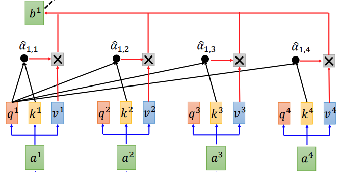

This is the second note on attention mechanism in deep learning. Two applications of attention mechanism will be introduced: 1. transformer architecture and  2. graph attention networks. 

* TOC
{: toc}
# Fully Self-Attention: Transformer

All seq2seq models that leverage the RNN related architecture require previous hidden state as input, which precludes parallelization within training examples. There are some existing work to replace RNN with CNN to parallelize the processing [4]. However, the paper [1] proposes a new network architecture, the Transformer, based solely on attention mechanisms, dispensing with  recurrence and convolutions entirely. 

## Self-Attention 

Self-attention means attention is placed on different position of same sentence to learn the correlation between the current words and the different part of the sentence. 

|           |
| :----------------------------------------------------------: |
| Figure 1. Self-attention Layer Illustration for Generating First Output [5] |

Let $a^1, \cdots, a^4$ denote the input of attention layer, which could be word embeddings of input sentence $(x^1, \cdots, x^4)$ or output of previous self-attention layer. Self-attention layer will compute 3 different values for each word embedding first: 

- $\mathbf{q}$:  query vector to match others   

  $$
  \mathbf{q}^i = \mathbf{W}^q \mathbf{a}^i
  $$
  
- $\mathbf{k}$: key vector to be matched

  $$
  \mathbf{k}^i = \mathbf{W}^k \mathbf{a}^i
  $$
  
- $\mathbf{v}$: information to be extracted 

	$$
	\mathbf{v}^i = \mathbf{W}^v \mathbf{a}^i
	$$

Like in Figure 1, in order to generate the first output, we attend first query $\mathbf{q}^1$ for every key $\mathbf{k}^i$ and we could obtain attention score $e_{1i}$ via the scaled dot-product attention:

$$
e_{1,i} = \frac{\mathbf{q}^1 \cdot\mathbf{k}^i }{\sqrt{n}} \quad \quad \forall i
$$

where $n$ is the dimension of $\mathbf{q}$. Then attention distribution for first output could be computed via the softmax function:

$$
\hat{\alpha}_{1,i} = \frac{\exp(e_{1,i})}{\sum_{i}\exp(e_{1,i})}
$$

Finally, the first output is the weighted sum of $\mathbf{v}^i$: 

$$
\mathbf{b}^1 = \sum_{i} \hat{\alpha}_{1,i} \mathbf{v}^i
$$

Similarly, we applied same process to generate the rest of output. It is worthing noting that $\mathbf{b}^1, \mathbf{b}^2, \mathbf{b}^3, \mathbf{b}^4$ could be computed in parallel, since the attention layer could be viewed as matrix multiplication operations [see [5] for details], by packing queries, keys, and values into matrices $Q$, $K$ and $V$. 

|          |
| :-------------------------------------------------------: |
| Figure 2. Scaled dot-product attention in matrix form [1] |

Like in Figure 2. we could compute the outputs as 

$$
\text { Attention }(Q, K, V)=\operatorname{softmax}\left(\frac{Q K^{T}}{\sqrt{n}}\right) V
$$

**Why using scaled dot-product rather than dot-product attention function ?** For large values of $n$ (the dimension of embedding) , the value of dot products grow large in magnitude, pushing the softmax function into regions where it has extremely small gradients. To counteract this effect, it would be better to scale the dot products by $\frac{1}{\sqrt{n}}$. 

## Multi-head Self-attention 

|  |
| :----------------------------------------------------------: |
|             Figure 3. Multi-Head Attention [1].              |

At the beginning of Multi-Head Attention, it linearly projects the queries, keys, and values  $h$ times with different, learned linear projections to $n, n,$ and $m$ dimensions, respectively. Attention function is then applied to these $h$ numbers of projected queries, keys, and values in parallel, yielding $h$ numbers of $m$-dimensional output values. These are concatenated and once again projected, resulting in the final values, as depicted in Figure 3 [1].  

The Multi-Head Attention could be mathematically expressed as :

$$
\begin{aligned}
\text { MultiHead }(Q, K, V) &\left.=\text { Concat(head }_{1}, \ldots, \text { head }_{\mathrm{h}}\right) W^{O} \\
\text { where head }_{\mathrm{i}} &=\text { Attention }\left(Q W_{i}^{Q}, K W_{i}^{K}, V W_{i}^{V}\right)
\end{aligned}
$$

where the projections are parameter matrices $W_i^Q \in \mathbb{R}^{p\times n}, W_i^K \in \mathbb{R}^{p\times n}, W_i^V \in \mathbb{R}^{p\times m}   $ and $W^O \in \mathbb{R}^{hm\times p} $ .

**Why Multi-Head Attention ?** Multi-head attention allows the model to jointly attend to information from different representation subspaces at different positions. There are a lot ongoing discussions about the usefulness of multi-head attention and the appropriated number of heads [6]. Here, I think intuitively, we could view the multi-head as different filters in CNN to capture different dependencies under different representations. 

**Why Self-Attention ?** The advantages of self-attention over other methods could be summarized as [1]:

- A self-attention layer connects all positions with a constant number of sequentially executed operations, whereas a recurrent layer requires $O(T)$ sequential operations. A single convolutional layer with kernel width $k < T$ does not connect all pairs of input and output positions. 
- The amount of computation that can be parallelized is significant. 
- Self-attention could yield more interpretable models.

## Positional Encoding 

One thing missing so far is, self-attention layer introduced above does not consider position information of the sequence.  The most intuitive way is to add the hand crafted position encoding into the input embedding. Also, the position encoding could be learned [4]. 

## Transformer 

|  |
| :-----------------------------------------: |
|     The Transformer model architecture.     |

**Encoder**: 

- a stack of N identical layers, each of which has two sub-layers.
- the first sub-layer is multi-head attention mechanism; the second sub-layer is simple position wise fully connected feed-forward network.
-  a residual connection around each of the two sub-layers, followed by layer normalization. 

**Decoder**: 

- a stack of N identical layers, each of which has three sub-layers.
- the output of encoder is also attended in decoder.
- the output embeddings are offset by one position to ensure that the predictions for position $i$ can depend only on the known outputs at positions less than $i$. 

# Graph Attention Networks 

Graph attention networks (GAT) is also inspired by attention mechanism. In this post, I will only cover the GAT architecture instead of comparison with other graph neural networks. 

## Graph Attention Layer 

Given a graph $\mathcal{G} = (\mathcal{V}, \mathcal{E}, )$ with a set of node features:

$$
\mathbf{h}=\left\{\vec{h}_{1}, \vec{h}_{2}, \ldots, \vec{h}_{N}\right\}, \vec{h}_{i} \in \mathbb{R}^{F}
$$

where $ \mid\mathcal{V}\mid = N$ and $F$ is the number of features in each node. The input of graph attention layer is just the set of node features $\mathbf{h}$, and the output of this layer is a new set of node features 

$$
\mathbf{h}^{\prime}=\left\{\vec{h}_{1}^{\prime}, \vec{h}_{2}^{\prime}, \ldots, \vec{h}_{N}^{\prime}\right\}, \vec{h}_{i}^{\prime} \in \mathbb{R}^{F^{\prime}}
$$

Graph attention layer leverages the multi-head attention, so for every single node $v_i$:

- obtain higher-level feature embedding for $v_i$ by a shared linear transformation, which is parameterized by a weight matrix $\mathbf{W} \in \mathbb{R}^{F'\times F}$ . 

- perform self-attention on the nodes - a shared attentional mechanism 

  $$
  a : \mathbb{R}^{F'} \times \mathbb{R}^{F'} \rightarrow \mathbb{R}
  $$
  
  computes attention score or coefficients on other nodes $v_j$ in the graph:

  $$
  e_{i j}=a\left(\mathbf{W} \vec{h}_{i}, \mathbf{W} \vec{h}_{j}\right)
  $$

that indicate the importance of node $v_j$'s features to node $v_i$.  However, in GAT, it only attends the first order neighbors of $v_i$ (including $v_i$), and 

$$
  e_{i j} = a\left(\mathbf{W} \vec{h}_{i}, \mathbf{W} \vec{h}_{j}\right) = \text { LeakyReLU }\left(\overrightarrow{\mathbf{a}}^{\top}\left[\mathbf{W} \vec{h}_{i} \| \mathbf{W} \vec{h}_{j}\right]\right)
$$

  where $\overrightarrow{\mathbf{a}} \in \mathbb{R}^{2F'}$ and $\|$ is the concatenation operation. 

  

- normalize the attention score with softmax function to obtain the attention distribution:

  $$
  \alpha_{i j}=\operatorname{softmax}_{j}\left(e_{i j}\right)=\frac{\exp \left(e_{i j}\right)}{\sum_{k \in \mathcal{N}_{i}} \exp \left(e_{i k}\right)}
  $$
  
  
	|  |
	| :-----------------------------------------------------: |
	|    Figure 1: The attention mechanism employed by [7]    |
	
	

- compute weighted sum of other nodes' features to serve as the final output feature (after potentially applying a nonlinearity, $\sigma$ ):

  $$
  \vec{h}_{i}^{\prime}=\sigma\left(\sum_{j \in \mathcal{N}_{i}} \alpha_{i j} \mathbf{W} \vec{h}_{j}\right)
  $$
  
- for multi-head attention, $K$ independent attention meachanisms execute the transformation of equation (14) by using $K$ different matrices $W$ , and then their features are concatenated :

  $$
  \vec{h}_{i}^{\prime}=\|_{k=1}^{K} \sigma\left(\sum_{j \in \mathcal{N}_{i}} \alpha_{i j}^{k} \mathbf{W}^{k} \vec{h}_{j}\right)
  $$
  
  if it is final (prediction layer) of the network with multi-head attention, then the output becomes:

  $$
	\vec{h}_{i}^{\prime}=\sigma\left(\frac{1}{K} \sum_{k=1}^{K} \sum_{j \in \mathcal{N}_{i}} \alpha_{i j}^{k} \mathbf{W}^{k} \vec{h}_{j}\right)
	$$
	
	|       |
	| :----------------------------------------------------------: |
	| Figure 2. An illustration of multi-head attention (with $K=3$ heads) by node $v_1$ on its neighbors. Different arrow styles and colors denote independent attention computations. |
	
	

# Reference 

[1] Vaswani, Ashish, et al. "Attention is all you need." *Advances in neural information processing systems*. 2017.

[2] [The Illustrated Transformer](http://jalammar.github.io/illustrated-transformer/)

[3] [Attention? Attention!](https://lilianweng.github.io/lil-log/2018/06/24/attention-attention.html#born-for-translation) 

[4] Gehring, Jonas, et al. "Convolutional sequence to sequence learning." *Proceedings of the 34th International Conference on Machine Learning-Volume 70*. JMLR. org, 2017. 

[5] [Transformer Lecture by Hung-yi Lee](https://www.youtube.com/watch?v=ugWDIIOHtPA&t=3s)

[6] [Why Transformer Needs Multi-head Attention ?](https://www.zhihu.com/question/341222779)

[7] [Graph Attention Networks](Veličković, Petar, et al. "Graph attention networks." *arXiv preprint arXiv:1710.10903* (2017).) 

[8] [The Annotated Transformer](http://nlp.seas.harvard.edu/2018/04/03/attention.html) 

